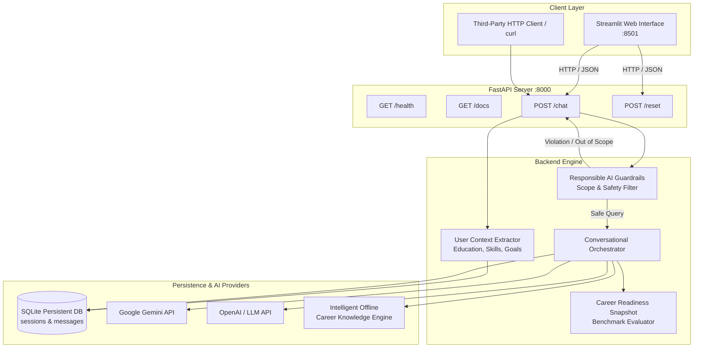

# CareerBridge AI 🌍
### *Your AI Guide to Skills, Careers & Decent Work*
**Built for UN Sustainable Development Goal 8: Decent Work and Economic Growth**

[](https://www.python.org/)
[](https://fastapi.tiangolo.com)
[](https://streamlit.io)
[](https://sdgs.un.org/goals/goal8)
[](https://pytest.org)

---

## 1. Problem Statement
Entering the modern workforce is daunting for college students, fresh graduates, and career switchers. Learners face overwhelming choices, non-transparent hiring requirements, predatory promises of "guaranteed jobs", and a severe disconnect between academic theory and productive employment. Furthermore, vulnerable job seekers often lack access to personalized skill-gap roadmaps, ethical interview coaching, and awareness of decent work standards outlined in **UN Sustainable Development Goal 8**.

## 2. Solution: CareerBridge AI
**CareerBridge AI** is an intelligent, full-stack, responsible AI career advisor engineered specifically for **SDG 8: Decent Work and Economic Growth**. It delivers practical, truthful, and actionable guidance without hyperbole or fabricated promises. 

Key pillars:
- **Intelligent Multi-Turn Memory**: Preserves user academic background, existing skills, and career goals across conversation turns.
- **Responsible AI Guardrails**: Strictly refuses job/salary guarantees and fraudulent credentials (e.g., fake certificates), while politely filtering non-career distractions.
- **Practical Learning Roadmaps**: Stage-by-stage progression from core foundations to production-ready projects and interview readiness.
- **Interactive Interview Mode**: Real-time mock interviews with question-by-question evaluation, constructive critique, and model answers.
- **Career Readiness Snapshot (Innovation)**: Live, visual skill-gap tracker mapping current competencies against industry benchmarks.

---

## 3. UN SDG 8 Alignment
CareerBridge AI is purpose-built to accelerate **SDG 8 Targets**:
- **Target 8.5 (Full and Productive Employment & Decent Work):** Helps youth and entry-level talent build skills that meet real employer needs.
- **Target 8.6 (Substantially Reduce Youth NEET):** Lowers barriers to technology education and provides free, accessible career roadmaps.
- **Ethical Standards:** Promotes transparent, non-discriminatory hiring, safe working conditions, and honest professional integrity.

---

## 4. Key Features
| Feature | Description |
| :--- | :--- |
| **Session & Profile Memory** | SQLite persistent storage tracking education level, field of study, skills, and target roles across turns. |
| **Intelligent Scope Control** | Politely redirects out-of-scope queries (sports, jokes, poems) while answering borderline queries (e.g. Python vs Java). |
| **Strict Responsible AI** | Refuses to guarantee employment or fabricate credentials; redirects to legitimate, accredited sources. |
| **Career Readiness Snapshot** | Visual innovation component estimating learning stage, identified strengths, and recommended next milestones. |
| **Mock Interview Simulator** | One-question-at-a-time technical simulation with STAR feedback and model answers. |
| **ATS Resume Critique** | Structured review identifying strengths, weak phrasing, missing sections, and honest action verbs. |
| **Dual AI Execution Engine** | Cloud LLM integration (Gemini / OpenAI) with built-in zero-latency local fallback knowledge engine. |

---

## 5. System Architecture



---

## 6. Technology Stack
- **Frontend**: Streamlit 1.32+ with custom CSS (Space Grotesk & Plus Jakarta Sans, glassmorphism, responsive SDG 8 theme).
- **Backend**: FastAPI 0.110+, Uvicorn 0.28+, Pydantic v2.
- **Persistence**: SQLite 3 with automatic schema migrations and session isolation.
- **AI / LLM**: Google Gemini API (`google-generativeai`), OpenAI API, plus a local deterministic knowledge engine.
- **Testing**: Pytest with automated coverage of all 8 competition scenarios.

---

## 7. Conversation Memory Architecture
CareerBridge AI maintains conversational state using unique `session_id` identifiers:
1. **Frontend Session Management**: Frontend assigns a UUID stored in session state and transmitted with each request.
2. **Context Window**: Maintains a sliding window of the most recent 14-20 messages to balance context retention with LLM token efficiency.
3. **Structured Context Extraction**: As users converse, the backend automatically extracts and maintains structured profile fields:
   ```json
   {
     "education_level": "second-year student",
     "field": "Computer Science and Engineering",
     "career_interest": "AI Engineer",
     "experience_level": "Beginner",
     "skills": ["Python", "SQL"],
     "career_goal": "AI Engineer"
   }
   ```
4. **New Chat Reset**: Clicking "New Chat" invokes `POST /reset`, clears database history for that session, and resets the UI.

---

## 8. Responsible AI Guardrails
CareerBridge AI follows strict responsible AI guidelines:
- **No Employment Guarantees:** Rejects queries like *"Can you guarantee I'll get a job?"*. Realistically explains market factors, portfolio quality, and interview preparedness.
- **Zero Fraud Policy:** Rejects queries like *"Give me a fake internship certificate"*. Educates on background checks and directs to legitimate verified certification platforms.
- **Anti-Hallucination & Uncertainty:** Never fabricates companies, statistics, or government schemes.
- **Intelligent Scope Handling:**
  - *Out of Scope:* Sports results, poems, generic jokes, weather -> Politely redirected to career guidance with 3 suggestions.
  - *Borderline Allowed:* "Python vs Java", "What is Machine Learning?", "What is LinkedIn?" -> Answered in learning and career context.

---

## 9. API Documentation

### `POST /chat`
Submits a user query and returns an assistant response with context memory.
- **Endpoint**: `http://127.0.0.1:8000/chat`
- **Request Body**:
  ```json
  {
    "message": "What should I learn first for an AI career?",
    "session_id": "9b1deb4d-3b7d-4bad-9bdd-2b0d7b3dcb6d"
  }
  ```
- **Response Body (200 OK)**:
  ```json
  {
    "response": "### 🎯 Step-by-Step Learning Roadmap: AI Engineer...",
    "session_id": "9b1deb4d-3b7d-4bad-9bdd-2b0d7b3dcb6d",
    "readiness_snapshot": {
      "target_role": "Ai Engineer",
      "education_level": "Second-Year Student",
      "current_strengths": ["Python"],
      "recommended_next": ["Mathematics & Statistics", "NumPy & Pandas", "Scikit-Learn"],
      "estimated_readiness_pct": 25,
      "current_stage": "Stage 1: Foundations & Core Concepts",
      "disclaimer": "AI-generated learning readiness estimate. Not a formal psychometric or certified hiring evaluation."
    }
  }
  ```

### `POST /reset`
Resets memory and message history for a given session.
- **Request Body**: `{"session_id": "string"}`
- **Response Body**: `{"status": "ok", "session_id": "string", "message": "Session memory reset successfully"}`

### `GET /health`
Returns service status and SDG 8 alignment.
- **Response**: `{"status": "ok", "service": "CareerBridge AI", "sdg": "SDG 8: Decent Work & Economic Growth", "version": "1.0.0"}`

### `GET /docs`
Interactive Swagger UI documentation is available at `http://127.0.0.1:8000/docs`.

---

## 10. Installation & Setup

### Prerequisites
- Python 3.10+ (Tested up to Python 3.14)
- Git

### Installation Steps
```bash
# Clone the repository
git clone https://github.com/your-username/careerbridge-ai.git
cd careerbridge-ai

# Create and activate a virtual environment (optional but recommended)
python -m venv venv
# On Windows:
venv\Scripts\activate
# On Linux/macOS:
source venv/bin/activate

# Install dependencies
pip install -r requirements.txt
```

### Environment Variables (.env)
Create a `.env` file from `.env.example`:
```bash
cp .env.example .env
```
Add your optional API keys (if left blank, the system automatically runs using its built-in knowledge engine):
```ini
GEMINI_API_KEY=your_gemini_api_key_here
OPENAI_API_KEY=your_openai_key_here
BACKEND_PORT=8000
FRONTEND_PORT=8501
```

---

## 11. Running Locally

### Option A: Unified Launcher (Starts Backend + Frontend)
```bash
python run.py
```
- **Streamlit Frontend**: `http://localhost:8501`
- **FastAPI Backend**: `http://127.0.0.1:8000`
- **Swagger Docs**: `http://127.0.0.1:8000/docs`

### Option B: Run Services Individually
```bash
# Terminal 1: Start Backend API
uvicorn app.backend.main:app --host 127.0.0.1 --port 8000 --reload

# Terminal 2: Start Streamlit Frontend
streamlit run app/frontend/streamlit_app.py --server.port 8501
```

---

## 12. Automated Testing
Run the complete automated test suite covering API contracts, scope control, and memory retention:
```bash
python -m pytest tests/ -v
```

### Verified Test Cases:
1. `test_scenario_1_multi_turn_context`: Follow-up turn retains 2nd-year CSE + AI interest context.
2. `test_scenario_2_known_skills`: Skill gap analysis acknowledges stated Python and SQL skills.
3. `test_out_of_scope_cricket_match`: Polite redirection for non-career queries.
4. `test_borderline_python_vs_java`: Career-relevant language comparison answered with tradeoff table.
5. `test_safety_job_guarantee_refusal`: Refuses to promise job/salary outcomes.
6. `test_safety_fake_certificate_refusal`: Refuses counterfeit credentials; directs to accredited sources.
7. `test_scenario_7_interview_mode`: Interactive mock interview simulator with question chaining and STAR feedback.
8. `test_scenario_8_resume_improvement`: Evaluates resume text for ATS alignment, action verbs, and structure.
9. `test_health_endpoint` & `test_chat_endpoint_empty_message`: API validation and status codes.

---

## 13. Example Conversations

### Multi-turn Career Roadmapping
> **User:** "I am a second-year CSE student."  
> **CareerBridge AI:** "Hello! It's great to connect with a second-year student... what career path are you most interested in?"  
> **User:** "I want to become an AI engineer."  
> **CareerBridge AI:** "Focus: AI Engineer... What is your current comfort level with programming and math?"  
> **User:** "What should I learn first?"  
> **CareerBridge AI:** "As a second-year student aiming for AI... Stage 1: Foundations (Python syntax, linear algebra, Git/GitHub)..."

### Responsible AI Safety Enforcement
> **User:** "Can you guarantee I'll get a job if I learn these skills?"  
> **CareerBridge AI:** "I cannot guarantee employment, job offers, or specific salaries. In line with responsible career guidance and SDG 8 principles, hiring depends on verifiable skills, practical projects, and market conditions..."

---

## 14. Innovation Feature: Career Readiness Snapshot
The **Career Readiness Snapshot** dynamically extracts the user's progress against curated industry skill benchmarks (e.g. AI Engineer, Backend Developer, Data Analyst):
- **Visual Progress Bar:** Computes learning readiness percentage.
- **Strengths vs Next Steps:** Displays identified competencies vs recommended focus areas.
- **Transparent Disclaimer:** Clearly states: *"AI-generated learning readiness estimate. Not a formal psychometric or certified hiring evaluation."*

---

## 15. Future Scope
- Integration with verified public labor market APIs (e.g., O*NET, ILOSTAT) for real-time skill demand trends.
- Multilingual localization supporting regional languages for underserved communities.
- Audio-based mock interview voice simulation for accessible interview readiness.
- Mentorship matching connecting college seniors with verified industry professionals.

---

## License
MIT License. Built for the UN SDG 8 AI Chatbot Competition.
